# PROJECT BIG DATA SPARK-SCALA - CDELACRUZ

## Dataset

The **Instagram** dataset will be used for implementing different analysis to know the information and get a relevant summary.
The total size of the dataset is: **13.89 GB**
The total columns to use are: **25 columns**

Link: [https://www.kaggle.com/datasets/shmalex/instagram-dataset]


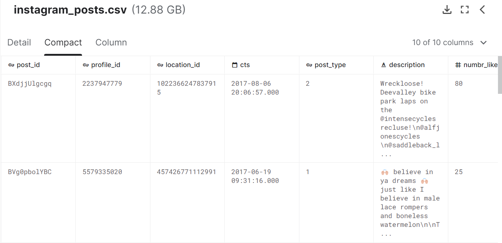

## Architeture of the Cluster
The cluster was created with docker using the default configuration available through the RTJVM Course Spark essentials
with: `docker-compose up --scale spark-worker=3`

Check the folder spark-cluster for more Details.

And processed through spark Submit eg:
`/spark/bin/spark-submit --class cdelacruz.TestDeployApp --deploy-mode client --master spark://deecde3d9856:7077 --verbose --supervise /opt/spark-apps/spark-essentials.jar /opt/spark-data/movies.json /opt/spark-data/summary`


## Reading and Defining Schema

The Spark Session was defined as: 

```scala
  def my_spark: SparkSession = {
    val spark = SparkSession.builder()
      .config("spark.master", "local[*]")
      .appName("SparkByExample")
      .getOrCreate()
    return spark
  }
```

The first read was done to get a sample as:

```scala
  lazy val df_insta = my_spark.read.parquet("src/main/resources/single_file/instagram.parquet")
  df_insta.show(10)
```
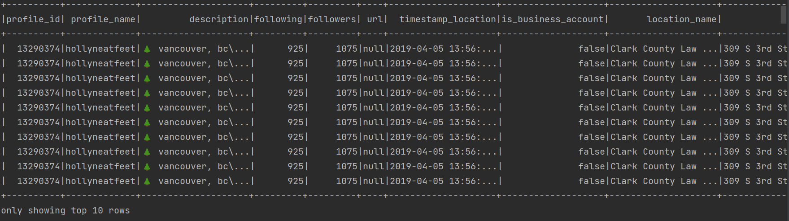


## How the Dataset is processed

There is 3 Main files on the Project inside the myDataset Package.
### Functions.scala
In this file is defined the functions to generate the differentes processes and in this way be able to reuse code at any time..

`checkSource()`-> It performs two validations, the first is to validate that the folder that is being indicated exists and finally to validate the specified file really is a file and not just a folder.

`my_spark` -> It performs the spark instantiation, this allows us to use spark in all our code or different objects belonging to the project.

`readCSV()` -> It allows us to read a CSV file to a dataframe, which is custom generated according to the necessary options to read it.

`renameFile()` -> It performs the renaming of a file, validating that it does not exist with the same name, if it exists, it renames the file with a consecutive number (according to the number of files with that name) and the selected name.

`writeCSV()` -> It allows us to write/create a CSV file from a dataframe, which is custom generated according to the options needed to write it.

### ReadData.scala

The objective of this object is to read the selected dataset with the functions that we have previously created. Join the sources according to the analyzes that need to be created. And typify the information according to the type of data in each of the columns, it has been done in two ways: 

The first is reading the csv delivering a schema created by us. 

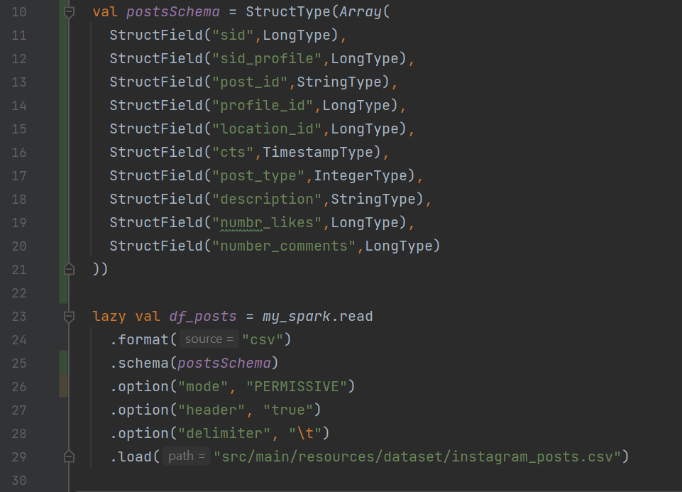

The second the columns have been casted at our discretion.


### AnalyzeData.scala
Inside of this file we'll find the different queries made to answer the questions regarding the given dataset, generating a summary through a parquet file.

### Main.scala
File in which we will perform a deployment in a cluster through docker, according to what was learned in TheRockJVM course.


## Questions to answer with the dataset:


### 1 - How many of the records are totally and per year?

```scala
println("n_reg: "+ df_insta.count())

df_insta.select(
year(col("timestamp_post")).as("year_post")
)
.where(col("year_post").isNotNull)
.groupBy(col("year_post"))
.agg(
    count(col("*")).as("n_posts")
)
.orderBy(desc_nulls_last("year_post"))
.show()
```

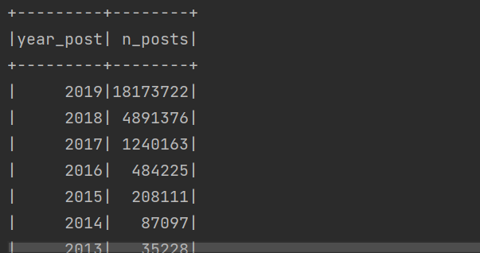


### 2 - What are the peak times (hours) of posts per year?
```scala
df_insta.select(
year(col("timestamp_post")).as("year_post"),
hour(col("timestamp_post")).as("hour_post")
)
.where(
    col("timestamp_post").isNotNull
)
.groupBy(col("year_post"),col("hour_post"))
.agg(
    count("*").as("n_reg")
)
.orderBy(desc_nulls_last("n_reg"))
.show()
```

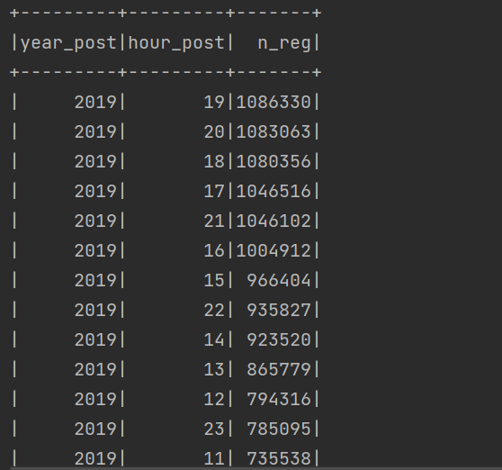


### 3 - What are the hashtag most used in the posts?

```scala
df_insta.select(
"post_id",
"description_post"
)
.withColumn("hashtag", explode(split(col("description_post")," ")))
.where(
    col("hashtag").like("#%")
)
.groupBy(col("hashtag"))
.agg(
    count("*").as("count")
)
.orderBy(desc_nulls_last("count"))
.show()
```

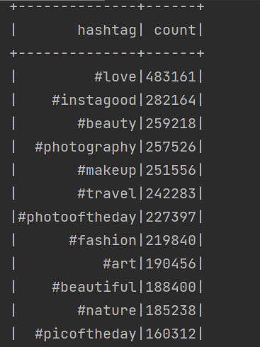


### 4 - What are the most visited cities (by country).

```scala
df_locations.groupBy(
when(col("cd") === "US", "United States")
    .otherwise(col("cd")).as("country"),
col("city")
)
//.groupBy(col("cd"))
.agg(
    count("*").as("n_reg")
)
.where(
    col("country").isNotNull
    and col("city").isNotNull
)
.orderBy(desc_nulls_last("n_reg"))
.show()
```

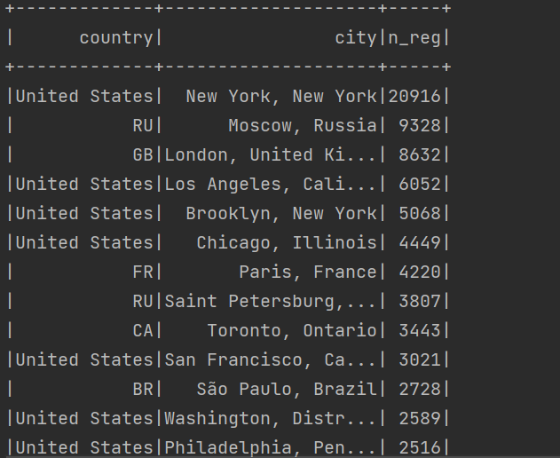


### 5 - What are the most post type used in the posts?

```scala
df_posts.select(
year(col("cts")).as("year_post"),
when(col("post_type")===1,"photo")
    .when(col("post_type")===2,"video")
    .when(col("post_type")===3,"multy")
    .as("post_type")
)
.groupBy(col("year_post"),col("post_type"))
.agg(
    count("*").as("n_reg")
)
.where(col("year_post").isNotNull)
.orderBy(desc("year_post"),desc("n_reg"))
.show()
```

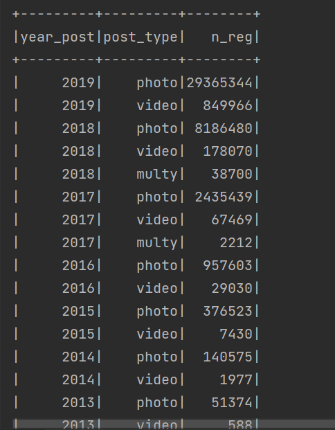


### 6 - //What are the post type with the greatest impact per year?

```scala
val df_impact_posts = df_posts.select(
year(col("cts")).as("year_post"),
when(col("post_type") === 1, "photo")
    .when(col("post_type") === 2, "video")
    .when(col("post_type") === 3, "multy")
    .as("post_type"),
col("numbr_likes"),
col("number_comments")
)
.groupBy(col("year_post"), col("post_type"))
.agg(
    sum("numbr_likes").as("number_likes"),
    sum("number_comments").as("number_comments")
)
.where(col("year_post").isNotNull)
.orderBy(
    desc("year_post"),
    desc("number_likes"),
    desc("number_comments")
)
.show()
```

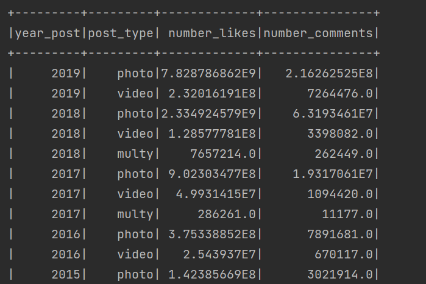


### 7 - What are the days with the most posts per year?

```scala
  val df_date_x_post = df_posts.select(
    year(col("cts")).as("year_post"),
    dayofweek(col("cts")).as("day_of_week"),
    date_format(col("cts"), "EEEE").as("name_day_of_week")
  )
    .groupBy(
      col("year_post"),
      col("name_day_of_week")
    )
    .agg(
      count("*").as("n_reg")
    )
    .where(col("year_post").isNotNull)
    .orderBy(
      desc("year_post"),
      desc("n_reg")
    )
    .show()
```

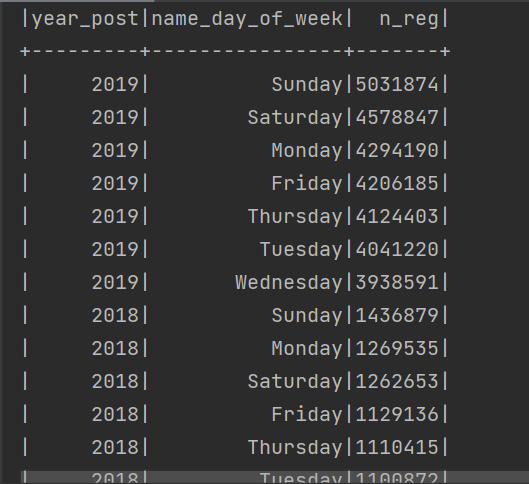


### 8 - What is the average of characters used through the years?

```scala
df_posts.select(
year(col("cts")).as("year_post"),
col("description")
)
.withColumn("characters", split(col("description"), ""))
.withColumn("n_characters", size(col("characters")))
.groupBy(col("year_post"))
.agg(
    avg(col("n_characters")).cast(DecimalType(10,2)).as("avg_n_characters")
)
.where(col("year_post").isNotNull)
.orderBy(desc("year_post"))
.show()
```

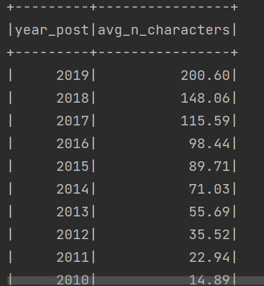


### 9 - What are the characteristics of a profile with a lot of impact on posts?

```scala
val df_profile_post_impact_1 = df_insta.select(
col("timestamp_post"),
col("profile_id"),
col("following"),
col("followers"),
col("is_business_account"),
col("description_post"),
col("post_type"),
col("number_likes"),
col("number_comments")
)
.withColumn(
    "hashtags",
    explode(split(col("description_post"), " "))
)
.withColumn("n_characters", size(split(col("description_post"), "")))
.where(
    col("hashtags").like("#%")
    and col("profile_id").isNotNull
    and col("number_likes").isNotNull
    and col("number_comments").isNotNull
    and col("followers").isNotNull
    and col("n_characters").isNotNull
)
.groupBy(
    "timestamp_post",
    "profile_id",
    "following",
    "followers",
    "is_business_account",
    "description_post",
    "post_type",
    "number_likes",
    "number_comments",
    "n_characters"
)
.agg(
    count("*").as("n_hashtags")
)


val df_profile_post_impact_2 = df_profile_post_impact_1.select(
year(col("timestamp_post")).as("year"),
col("profile_id"),
col("following"),
when(col("followers").between(0, 1000), "0_to_1k_followers")
    .when(col("followers").between(1001, 10000), "1k_to_10k_followers")
    .when(col("followers").between(10001, 100000), "10k_to_100k_followers")
    .when(col("followers").between(100001, 1000000), "100k_to_1m_followers")
    .when(col("followers")>1000000, "more_than_1m_followers")
.as("followers"),
col("is_business_account"),
when(col("post_type") === 1, "photo")
    .when(col("post_type") === 2, "video")
    .when(col("post_type") === 3, "multy")
    .as("post_type"),
col("number_likes"),
col("number_comments"),
when(col("n_characters").between(0, 50), "0_to_50_characters")
    .when(col("n_characters").between(51, 100), "50_to_100_characters")
    .when(col("n_characters").between(101, 150), "100_to_150_characters")
    .when(col("n_characters").between(151, 200), "150_to_200_characters")
    .when(col("n_characters").between(201, 250), "200_to_250_characters")
    .when(col("n_characters").between(251, 300), "250_to_300_characters")
    .when(col("n_characters") > 300, "more_than_300_characters")
    .as("number_characters"),
when(col("n_hashtags").between(0, 10), "0_to_10_hashtags")
    .when(col("n_hashtags").between(11, 20), "10_to_20_hashtags")
    .when(col("n_hashtags").between(21, 30), "20_to_30_hashtags")
    .when(col("n_hashtags").between(31, 40), "30_to_40_hashtags")
    .when(col("n_hashtags").between(41, 50), "40_to_50_hashtags")
    .when(col("n_hashtags")>50, "more_than_50_hashtags")
    .as("number_hashtags")
)


val df_profile_post_impact = df_profile_post_impact_2.groupBy(
col("year"),
col("followers"),
col("is_business_account"),
col("post_type"),
    col("number_characters"),
col("number_hashtags")
)
    .agg(
    sum("number_likes").as("total_likes"),
    sum("number_comments").as("total_comments")
    )
    .orderBy(
    desc("year"),
    desc("total_likes"),
    desc("total_comments")
    )

df_profile_post_impact.show()
```

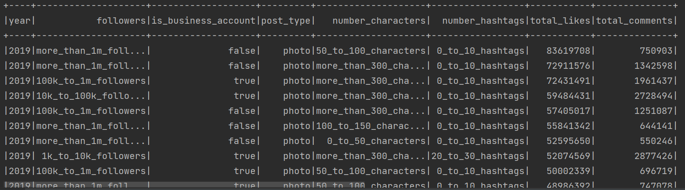