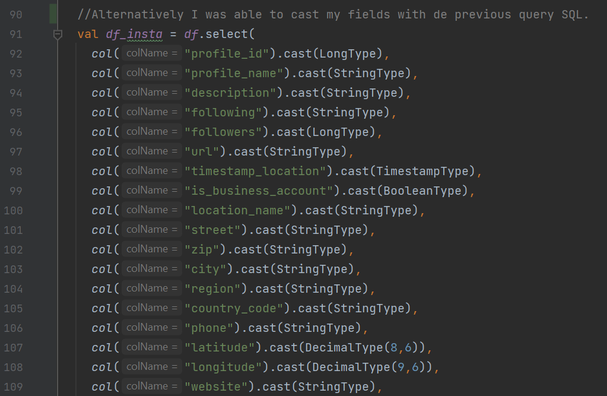

# PROJECT BIG DATA SPARK-SCALA - CDELACRUZ

## Dataset

The **Instagram** dataset will be used for implementing different analysis to know the information and get a relevant summary.

The total size of the dataset is: **13.89 GB**
The total columns to use are: **25 columns**  


**Observations:**  

source profiles:    94% of the records of 'profile_name' are null.   
                    97% of the records of 'firstname_lastname' are null.  
                    99% of the records of 'description' are null.  
  
source posts:       97% of the records of 'description' are null.  
  
source locations:   57% of the records of 'name' are null.  
                    95% of the records of 'city' are null.  
                    99% of the records of 'cd' are null.  
 

For specific analyses, the 3 main sources were combined, giving a total of: **27,434,459** records that were matched.


Link: [https://www.kaggle.com/datasets/shmalex/instagram-dataset]


## Architeture of the Cluster
The cluster was created with docker using the default configuration available through the RTJVM Course Spark essentials
with: `docker-compose up --scale spark-worker=3`

Check the folder spark-cluster for more Details.

And processed through spark Submit eg:
`/spark/bin/spark-submit --class cdelacruz.Main --deploy-mode client --master spark://deecde3d9856:7077 --verbose --supervise /opt/spark-apps/spark-essentials.jar /opt/spark-data/instagram_locations.csv /opt/spark-data/summary`


## Reading and Defining Schema

The Spark Session was defined as: 

```scala
  def my_spark: SparkSession = {
    val spark = SparkSession.builder()
      .config("spark.master", "local[*]")
      .appName("BigDataScala")
      .getOrCreate()
    return spark
  }
```

The first read was done to get a sample as:

```scala
  lazy val df_insta = my_spark.read.parquet("src/main/resources/single_file/instagram.parquet")
  df_insta.show(10)
```


## How the Dataset is processed

There are 3 Main files on the Project inside the myDataset Package.
### Functions.scala
In this file is defined the functions to generate the differentes processes and in this way be able to reuse code at any time..

`checkSource()`-> It performs two validations, the first is to validate that the folder that is being indicated exists and finally to validate the specified file really is a file and not just a folder.

`my_spark` -> It performs the spark instantiation, this allows us to use spark in all our code or different objects belonging to the project.

`readCSV()` -> It allows us to read a CSV file to a dataframe, which is custom generated according to the necessary options to read it.

`renameFile()` -> It performs the renaming of a file, validating that it does not exist with the same name, if it exists, it renames the file with a consecutive number (according to the number of files with that name) and the selected name.

`writeCSV()` -> It allows us to write/create a CSV file from a dataframe, which is custom generated according to the options needed to write it.

### ReadData.scala

The objective of this object is to read the selected dataset with the functions that we have previously created. Join the sources according to the analyzes that need to be created. And typify the information according to the type of data in each of the columns, it has been done in two ways: 

The first one, is reading the csv delivering a schema created by us. 


The second one, the columns have been casted at our discretion.




### AnalyzeData.scala
Inside of this file we'll find the different queries made to answer the questions regarding the given dataset, generating a summary through a parquet file.


## Questions to answer with the dataset:


### 1 - How many of the records are totally and per year?

```scala
println("n_reg: "+ df_insta.count())

df_insta.select(
year(col("timestamp_post")).as("year_post")
)
.where(col("year_post").isNotNull)
.groupBy(col("year_post"))
.agg(
    count(col("*")).as("n_posts")
)
.orderBy(desc_nulls_last("year_post"))
.show()
```


### 2 - What are the peak times (hours) of posts per year?
```scala
df_insta.select(
year(col("timestamp_post")).as("year_post"),
hour(col("timestamp_post")).as("hour_post")
)
.where(
    col("timestamp_post").isNotNull
)
.groupBy(col("year_post"),col("hour_post"))
.agg(
    count("*").as("n_reg")
)
.orderBy(desc_nulls_last("n_reg"))
.show()
```


### 3 - What are the hashtag most used in the posts?

```scala
df_insta.select(
"post_id",
"description_post"
)
.withColumn("hashtag", explode(split(col("description_post")," ")))
.where(
    col("hashtag").like("#%")
)
.groupBy(col("hashtag"))
.agg(
    count("*").as("count")
)
.orderBy(desc_nulls_last("count"))
.show()
```


### 4 - What are the most visited cities (by country).

```scala
df_locations.groupBy(
when(col("cd") === "US", "United States")
    .otherwise(col("cd")).as("country"),
col("city")
)
//.groupBy(col("cd"))
.agg(
    count("*").as("n_reg")
)
.where(
    col("country").isNotNull
    and col("city").isNotNull
)
.orderBy(desc_nulls_last("n_reg"))
.show()
```


### 5 - What are the most post type used in the posts?

```scala
df_posts.select(
year(col("cts")).as("year_post"),
when(col("post_type")===1,"photo")
    .when(col("post_type")===2,"video")
    .when(col("post_type")===3,"multy")
    .as("post_type")
)
.groupBy(col("year_post"),col("post_type"))
.agg(
    count("*").as("n_reg")
)
.where(col("year_post").isNotNull)
.orderBy(desc("year_post"),desc("n_reg"))
.show()
```


### 6 - //What are the post type with the greatest impact per year?

```scala
val df_impact_posts = df_posts.select(
year(col("cts")).as("year_post"),
when(col("post_type") === 1, "photo")
    .when(col("post_type") === 2, "video")
    .when(col("post_type") === 3, "multy")
    .as("post_type"),
col("numbr_likes"),
col("number_comments")
)
.groupBy(col("year_post"), col("post_type"))
.agg(
    sum("numbr_likes").as("number_likes"),
    sum("number_comments").as("number_comments")
)
.where(col("year_post").isNotNull)
.orderBy(
    desc("year_post"),
    desc("number_likes"),
    desc("number_comments")
)
.show()
```


### 7 - What are the days with the most posts per year?

```scala
  val df_date_x_post = df_posts.select(
    year(col("cts")).as("year_post"),
    dayofweek(col("cts")).as("day_of_week"),
    date_format(col("cts"), "EEEE").as("name_day_of_week")
  )
    .groupBy(
      col("year_post"),
      col("name_day_of_week")
    )
    .agg(
      count("*").as("n_reg")
    )
    .where(col("year_post").isNotNull)
    .orderBy(
      desc("year_post"),
      desc("n_reg")
    )
    .show()
```


### 8 - What is the average of characters used through the years?

```scala
df_posts.select(
year(col("cts")).as("year_post"),
col("description")
)
.withColumn("characters", split(col("description"), ""))
.withColumn("n_characters", size(col("characters")))
.groupBy(col("year_post"))
.agg(
    avg(col("n_characters")).cast(DecimalType(10,2)).as("avg_n_characters")
)
.where(col("year_post").isNotNull)
.orderBy(desc("year_post"))
.show()
```


### 9 - What are the characteristics of a profile with a lot of impact on posts?

```scala
val df_profile_post_impact_1 = df_insta.select(
col("timestamp_post"),
col("profile_id"),
col("following"),
col("followers"),
col("is_business_account"),
col("description_post"),
col("post_type"),
col("number_likes"),
col("number_comments")
)
.withColumn(
    "hashtags",
    explode(split(col("description_post"), " "))
)
.withColumn("n_characters", size(split(col("description_post"), "")))
.where(
    col("hashtags").like("#%")
    and col("profile_id").isNotNull
    and col("number_likes").isNotNull
    and col("number_comments").isNotNull
    and col("followers").isNotNull
    and col("n_characters").isNotNull
)
.groupBy(
    "timestamp_post",
    "profile_id",
    "following",
    "followers",
    "is_business_account",
    "description_post",
    "post_type",
    "number_likes",
    "number_comments",
    "n_characters"
)
.agg(
    count("*").as("n_hashtags")
)


val df_profile_post_impact_2 = df_profile_post_impact_1.select(
year(col("timestamp_post")).as("year"),
col("profile_id"),
col("following"),
when(col("followers").between(0, 1000), "0_to_1k_followers")
    .when(col("followers").between(1001, 10000), "1k_to_10k_followers")
    .when(col("followers").between(10001, 100000), "10k_to_100k_followers")
    .when(col("followers").between(100001, 1000000), "100k_to_1m_followers")
    .when(col("followers")>1000000, "more_than_1m_followers")
.as("followers"),
col("is_business_account"),
when(col("post_type") === 1, "photo")
    .when(col("post_type") === 2, "video")
    .when(col("post_type") === 3, "multy")
    .as("post_type"),
col("number_likes"),
col("number_comments"),
when(col("n_characters").between(0, 50), "0_to_50_characters")
    .when(col("n_characters").between(51, 100), "50_to_100_characters")
    .when(col("n_characters").between(101, 150), "100_to_150_characters")
    .when(col("n_characters").between(151, 200), "150_to_200_characters")
    .when(col("n_characters").between(201, 250), "200_to_250_characters")
    .when(col("n_characters").between(251, 300), "250_to_300_characters")
    .when(col("n_characters") > 300, "more_than_300_characters")
    .as("number_characters"),
when(col("n_hashtags").between(0, 10), "0_to_10_hashtags")
    .when(col("n_hashtags").between(11, 20), "10_to_20_hashtags")
    .when(col("n_hashtags").between(21, 30), "20_to_30_hashtags")
    .when(col("n_hashtags").between(31, 40), "30_to_40_hashtags")
    .when(col("n_hashtags").between(41, 50), "40_to_50_hashtags")
    .when(col("n_hashtags")>50, "more_than_50_hashtags")
    .as("number_hashtags")
)


val df_profile_post_impact = df_profile_post_impact_2.groupBy(
col("year"),
col("followers"),
col("is_business_account"),
col("post_type"),
    col("number_characters"),
col("number_hashtags")
)
    .agg(
    sum("number_likes").as("total_likes"),
    sum("number_comments").as("total_comments")
    )
    .orderBy(
    desc("year"),
    desc("total_likes"),
    desc("total_comments")
    )

df_profile_post_impact.show()
```


## SUMMARY

**Most active days:** Sunday and Saturday are good days to post and get more views and impact.


**Post type with more impact:** Photos is by far the type of post that has generated the most impact over time.


**Profiles with more followers:** The profiles with the most followers are those that use between 0 and 10 hashtags and use photo as their main post type.


As we can see, instagram is one of the largest social networks around the world, knowing how people interact is essential today for companies whose operating logic depends heavily on interactions through social networks (marketing agencies) .

There are a lot of courses on the internet that "teach" how to sell on social networks or how to get many views on posts, but the reality is that only by really analyzing the data can we see trends, characteristics of both profiles and the publications with the greatest impact.


# GOOCLE CLOUD PLATFORM

GCP is a suite of cloud computing services offered by Google. The platform includes a range of hosted services for compute, storage and application development that run on Google hardware. In this case is used it to load our information summary that we got in our spark process.

## Google Cloud Storage

GCS is a service for storing our objects in Google Cloud Platform. we created a bucket which can be done either with the command lines or UI.

Command line: gsutil mb gs://<YOUR_BUCKET_NAME>  
where <YOUR_BUCKET_NAME> = bucket-cdelacruz


We have created 2 folders in our storage. 

from_spark: Folder holds the files that we want to send to BigQuery.  
temp: Folder holds the files and logs that are produced when a dataflow job runs.


The summary tables uploaded are:  
  
1. date_x_post  
2. impact_posts  
3. profile_post_impact  
  
  
## Dataflow

Dataflow is a managed service for executing a wide variety of data processing patterns. In this case is used to do the different transformations as to have the control with null values, give the format correct in BQ and assign the schema with an external file and like this to have a more flexible process.  
  

To generate the previously mentioned process, we rely on the following code with the python programming language.  
  

```python
  def run(**kwargs):
    options = PipelineOptions()
    options.view_as(GoogleCloudOptions).project = kwargs.get('project')
    options.view_as(GoogleCloudOptions).region = kwargs.get('region')
    options.view_as(GoogleCloudOptions).staging_location = kwargs.get('stagingLocation')
    options.view_as(GoogleCloudOptions).temp_location = kwargs.get('tempLocation')
    options.view_as(GoogleCloudOptions).job_name = '{0}{1}'.format('my-pipeline-json-',time.time_ns())
    options.view_as(StandardOptions).runner = kwargs.get('runner')

    uri = kwargs.get('schema')
    matches = re.match("gs://(.*?)/(.*)", uri)
    if matches:
        bucket_name, path_name = matches.groups()
    bucket = bucket_name
    path = path_name

    keys_schema = keys_from_schema_txt(bucket, path)
    table_schema = schema_txt(bucket, path)

    p = beam.Pipeline(options=options)

    (p
    | 'Read_from_GCS' >> beam.io.ReadFromText(kwargs.get('input'), skip_header_lines=1)
    | 'Replace_Nulls' >> beam.Map(replace_nulls)
    | 'String To BigQuery Row' >> beam.Map(parse_method, keys = keys_schema)
    | 'Write_to_BigQuery' >> beam.io.WriteToBigQuery(
    kwargs.get('output'),
    schema=table_schema,
    create_disposition=beam.io.BigQueryDisposition.CREATE_IF_NEEDED,
    write_disposition=beam.io.BigQueryDisposition.WRITE_TRUNCATE))
    p.run().wait_until_finish()
```
  
  
To complete the previous code there are other 4 main functions that helps to process the data that we want to load to BigQuery.  
  
**replace_nulls:** This function takes a string with comma separated values as input and replaces all NULL values with an empty string.  
  
**parse_method:** This stage of the pipeline translates from a CSV file single row input as a string, to a dictionary object consumable by BigQuery.  
  
**schema_txt:** We get the name of the fields with their respective data types from the json file.  
  
**keys_from_schema_txt:** We get only the name of the fields from the json file.  
  

The json file has to have the next structure in the information:  


  
  

With the previous pipeline we don't need to change our schema with other information in the code, we only need to change de json file as long as our information is a CSV file.  
  

To execute the pipeline is neccesary to type the next command line in Google Shell:  
  
````
python3 BigDataScala/gcp/data_transformation_json.py \
--project=$PROJECT \
--region=us-central1 \
--runner=DataflowRunner \
--stagingLocation=gs://$BUCKET/temp \
--tempLocation gs://$BUCKET/temp \
--input gs://$BUCKET/from_spark/date_x_post/*.csv \
--output results.date_x_post \
--schema gs://$BUCKET/from_spark/date_x_post/schema_date_x_post.json
````
  

We can check the progress in job section of Dataflow:  
  

 


Successful completion of the job means that our reporting tables are available in BigQuery. 
  


## BigQuery

BQ is a fully managed enterprise data warehouse that helps you manage and analyze your data through built-in functions.  
  

  
  

With our information loaded in BigQuery we are able to analyze the information through SQL queries and different functions that BQ gives us.  
  

  